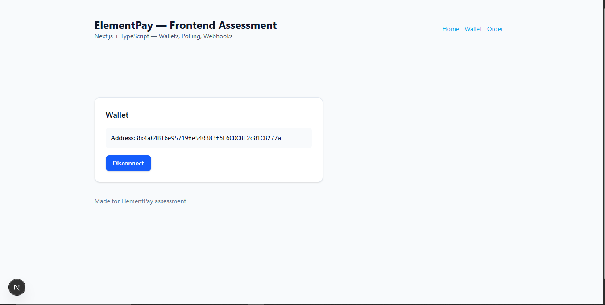
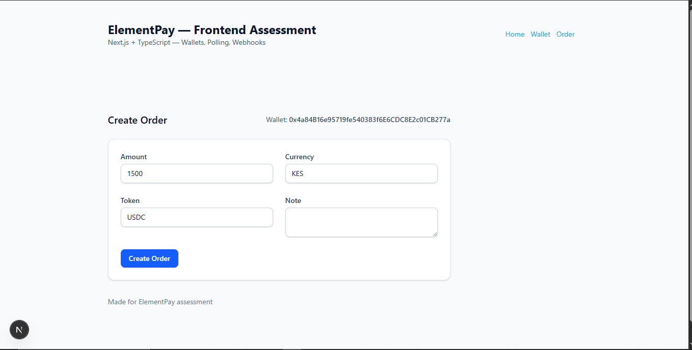
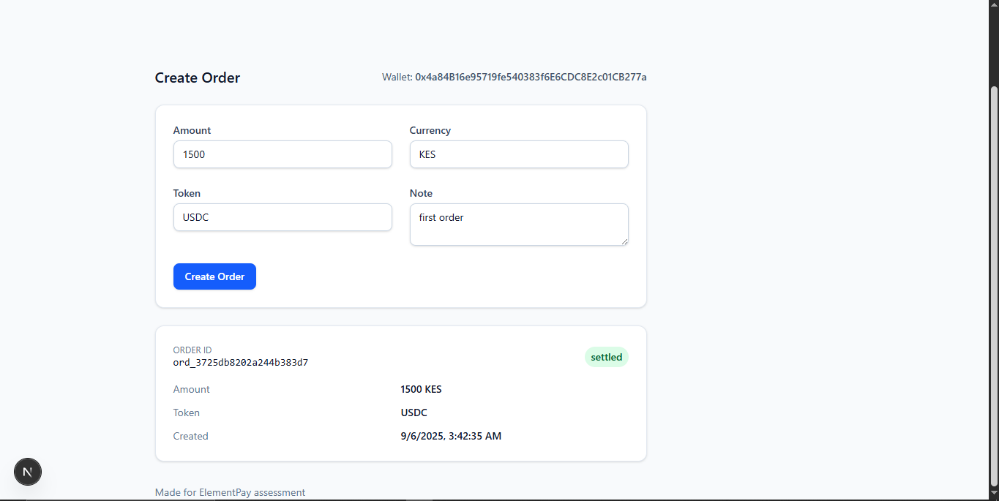

# ElementPay Frontend Assessment — Example Implementation

This repository contains a minimal Next.js (App Router) + TypeScript implementation for the ElementPay frontend assessment.

## Features

- MetaMask + WalletConnect support (via wagmi)
- Order creation form (disabled unless a wallet is connected)
- Mock API routes under `/api/mock/...` (in-memory)
- Polling every 3s + SSE stream for webhook updates
- Webhook verification with HMAC-SHA256 over raw body and timestamp freshness
- 60s timeout + retry UX
- README includes curl examples and .env.example

---



---

## Run locally

1. Node 18+, npm
2. Install:
   ```bash
   npm install
   ```
3. Copy `.env.example` to `.env.local` and set:
   ```
   WEBHOOK_SECRET=shh_super_secret
   NEXT_PUBLIC_WC_PROJECT_ID=
   ```
4. Run:
   ```bash
   npm run dev
   ```
5. Open http://localhost:3000

## Webhook curl examples

Valid (should 2xx):

```bash
curl -X POST http://localhost:3000/api/webhooks/elementpay \
  -H 'Content-Type: application/json' \
  -H 'X-Webhook-Signature: t=1710000000,v1=3QXTcQv0m0h4QkQ0L0w9ZsH1YFhZgMGnF0d9Xz4P7nQ=' \
  -d '{"type":"order.settled","data":{"order_id":"ord_0xabc123","status":"settled"}}'
```

Invalid signature (should 401/403):

```bash
curl -X POST http://localhost:3000/api/webhooks/elementpay \
  -H 'Content-Type: application/json' \
  -H 'X-Webhook-Signature: t=1710000300,v1=AAAAAAAAAAAAAAAAAAAAAAAAAAAAAAAAAAAAAAAAAAA=' \
  -d '{"type":"order.failed","data":{"order_id":"ord_0xabc123","status":"failed"}}'
```

## Notes & Assumptions

- In-memory store is used for the mock API (satisfies spec).
- SSE is used to deliver webhook updates to the browser.
- The `GET /api/mock/orders/:id` follows the time windows: 0-7s created, 8-17s processing, >=18s final (80% settled, 20% failed).
- Small, focused codebase to make review easy.

## Tests

There is a simple test under `tests/webhook.test.ts` that computes HMAC and compares to the provided test vector example. Run `npm run test` after installing dev deps.
